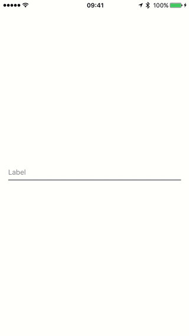

## KSOTextInputEditText

KSOTextInputEditText is an iOS framework for Android Material Design TextInputEditText styled UITextFields.

### Installation

You can install *KSOTextInputEditText* using [cocoapods](https://cocoapods.org/), [Carthage](https://github.com/Carthage/Carthage), or as a framework. When installing as a framework, ensure you also link to [Stanley](https://github.com/Kosoku/Stanley) and [Ditko](https://github.com/Kosoku/Ditko) as *KSOTextInputEditText* relies on them.

### Dependencies

Third party:

- [Stanley](https://github.com/Kosoku/Stanley)
- [Ditko](https://github.com/Kosoku/Ditko)
